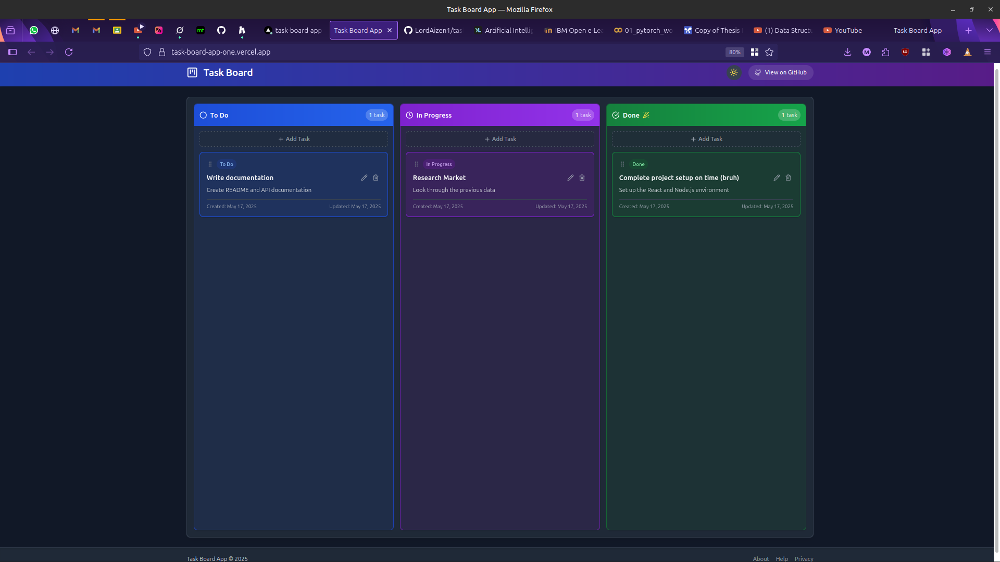

# Task Board Application

A modern task management board application with drag-and-drop functionality, built with React, TypeScript, and Express.js. This application allows users to organize tasks across different status columns (To Do, In Progress, Done) in a visually appealing interface with both light and dark mode support.



## Table of Contents

- [Features](#features)
- [Tech Stack](#tech-stack)
- [Project Structure](#project-structure)
- [Installation](#installation)
- [Running the Application](#running-the-application)
- [Component Documentation](#component-documentation)
- [API Documentation](#api-documentation)
- [Deployment](#deployment)
- [Development Notes](#development-notes)

## Features

- **Task Management**
  - Create, edit, and delete tasks
  - Organize tasks in three columns: To Do, In Progress, and Done
  - Persistent storage using a file-based backend

- **Drag and Drop**
  - Move tasks between columns with intuitive drag-and-drop functionality
  - Visual feedback during dragging operations
  - Celebratory animation when moving tasks to Done column

- **UI/UX**
  - Responsive design that works on both mobile and desktop
  - Light and dark mode with system preference detection
  - Modern, clean interface with subtle animations
  - Notification system for task completion

## Tech Stack

### Frontend
- **React 18** with TypeScript
- **Vite** for fast development and building
- **Tailwind CSS** for styling
- **React Beautiful DnD** for drag-and-drop functionality
- **Lucide React** for icons

### Backend
- **Node.js** with Express.js
- **File-based JSON storage**
- **RESTful API** design

## Project Structure

```
/
├── backend/                  # Backend server code
│   ├── server.js             # Express server implementation
│   └── tasks.json            # Database file for task storage
├── src/
│   ├── components/           # React components
│   │   ├── Board.tsx         # Main board component
│   │   ├── Column.tsx        # Column component
│   │   ├── TaskCard.tsx      # Task card component
│   │   ├── TaskForm.tsx      # Form for adding/editing tasks
│   │   ├── DeleteConfirmation.tsx # Delete confirmation modal
│   │   ├── ThemeToggle.tsx   # Dark/light mode toggle
│   │   ├── Header.tsx        # App header
│   │   ├── Confetti.tsx      # Confetti animation component
│   │   └── CompletionMessage.tsx # Task completion message
│   ├── contexts/             # React context providers
│   │   ├── TaskContext.tsx   # Task state management
│   │   └── ThemeContext.tsx  # Theme state management
│   ├── services/             # API services
│   │   └── api.ts            # API client
│   ├── types/                # TypeScript type definitions
│   │   └── index.ts          # Shared types
│   ├── App.tsx               # Main application component
│   ├── main.tsx              # Application entry point
│   └── index.css             # Global styles and animations
└── [Configuration files]     # Various configuration files
```

## Installation

### Prerequisites

- Node.js (v14.x or higher)
- npm (v6.x or higher)

### Steps

1. Clone the repository
   ```
   git clone https://github.com/yourusername/task-board-app.git
   cd task-board-app
   ```

2. Install dependencies
   ```
   npm install
   ```

## Running the Application

1. Start the backend server
   ```
   npm run server
   ```

2. In a new terminal, start the frontend development server
   ```
   npm run dev
   ```

3. Open your browser and navigate to http://localhost:5173

## Component Documentation

### src/App.tsx
The main application component that sets up the overall layout and wraps the application with necessary context providers.
- Provides `ThemeProvider` for dark/light mode functionality
- Provides `TaskProvider` for task state management
- Implements responsive layout with header, main content, and footer

### src/contexts/TaskContext.tsx
A React context that manages the application's task state and provides task-related functionality to all components.

**Functions:**
- `fetchAllTasks`: Loads tasks from the backend
- `addTask`: Creates a new task
- `updateTaskById`: Updates an existing task
- `removeTask`: Deletes a task
- `updateTaskStatusById`: Updates a task's status (used for drag-and-drop)

### src/contexts/ThemeContext.tsx
A React context that manages the application's theme (dark/light mode) and provides theme-related functionality.

**Functions:**
- `toggleTheme`: Switches between dark and light modes
- Automatically detects system preferences
- Persists theme preference in localStorage

### src/components/Board.tsx
The main board component that organizes tasks into columns and handles drag-and-drop logic.

**Functions:**
- `handleDragEnd`: Processes the end of a drag operation
- `handleAddTask`: Opens the task form for adding a new task
- `handleEditTask`: Opens the task form for editing an existing task
- `handleDeleteTask`: Opens the delete confirmation for a task
- `handleSubmitTask`: Processes task form submissions
- `handleConfirmDelete`: Processes task deletion confirmations

### src/components/Column.tsx
Represents a status column (To Do, In Progress, Done) that contains task cards.

**Functions:**
- `getColumnStyle`: Returns style classes based on column type
- `getHeaderStyle`: Returns header style classes based on column type
- `getColumnIcon`: Returns an appropriate icon for the column

### src/components/TaskCard.tsx
Represents an individual task card that can be dragged between columns.

**Functions:**
- `getStatusColor`: Returns color classes based on task status
- `getStatusBadge`: Returns badge style classes based on task status
- `getStatusLabel`: Returns a human-readable label for task status
- `formatDate`: Formats dates for display

### src/components/TaskForm.tsx
A modal form component for adding and editing tasks.

**Functions:**
- `handleSubmit`: Validates and submits the form
- Form state management for title, description, and status

### src/components/DeleteConfirmation.tsx
A modal confirmation dialog for task deletion.

### src/components/ThemeToggle.tsx
A button component that toggles between light and dark modes.

### src/components/Confetti.tsx
An animation component that displays a confetti effect when a task is completed.

**Functions:**
- `createConfetti`: Generates confetti particles with random properties

### src/components/CompletionMessage.tsx
A toast notification that appears when a task is moved to the Done column.

**Functions:**
- Auto-dismisses after a timeout
- Displays a random congratulatory message

### src/services/api.ts
A service module that handles API communication with the backend.

**Functions:**
- `fetchTasks`: Gets all tasks
- `createTask`: Creates a new task
- `updateTask`: Updates an existing task
- `deleteTask`: Deletes a task
- `updateTaskStatus`: Updates a task's status

## API Documentation

The backend provides a RESTful API for task management:

### Endpoints

- `GET /api/tasks`: Get all tasks
- `POST /api/tasks`: Create a new task
- `PUT /api/tasks/:id`: Update a task
- `DELETE /api/tasks/:id`: Delete a task
- `PATCH /api/tasks/:id/status`: Update a task's status

## Deployment

### Deploying to Netlify

1. Create a production build of the frontend
   ```
   npm run build
   ```

2. Create a `netlify.toml` file in the project root with the following content:
   ```toml
   [build]
     publish = "dist"
     command = "npm run build"

   [[redirects]]
     from = "/*"
     to = "/index.html"
     status = 200
   ```

3. Install Netlify CLI (if not already installed)
   ```
   npm install -g netlify-cli
   ```

4. Login to Netlify
   ```
   netlify login
   ```

5. Deploy the site
   ```
   netlify deploy
   ```
   
   Follow the prompts to complete the deployment.

6. For production deployment
   ```
   netlify deploy --prod
   ```

### Handling the Backend

For the backend, you'll need a service that can run Node.js applications. Here are some options:

1. **Render**: Offers easy Node.js deployment with a generous free tier
2. **Railway**: Simple deployment for Node.js apps
3. **Vercel**: Good for deploying Node.js applications
4. **Heroku**: Classic platform for Node.js applications (free tier no longer available)

After deploying the backend, update the `API_URL` in `src/services/api.ts` to point to your deployed backend URL.

## Development Notes

### Potential Improvements

1. User authentication and multi-user support
2. Customizable columns
3. Task priorities and due dates
4. Filter and search functionality
5. Labels and tags for tasks

### Known Issues

1. React Beautiful DnD has compatibility issues with React 18's Strict Mode. We've disabled Strict Mode to ensure proper drag-and-drop functionality. For a production application, consider using an alternative like `@hello-pangea/dnd` (a maintained fork of react-beautiful-dnd) or `dnd-kit`.